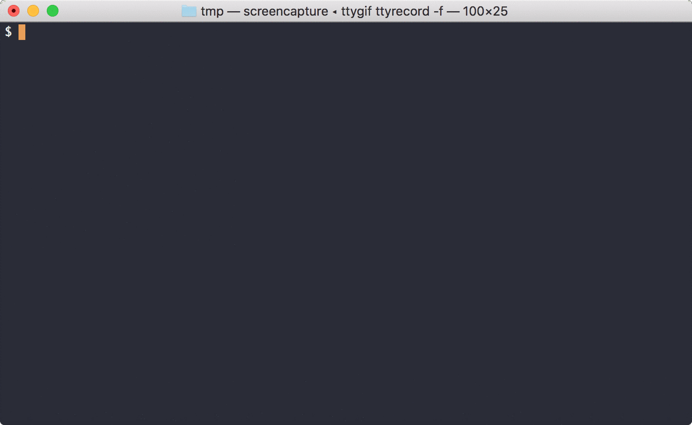

# Next-action

[](https://pypi.org/project/next-action/)
[](https://pyup.io/repos/github/fniessink/next-action/)
[](https://pyup.io/repos/github/fniessink/next-action/)
[](https://travis-ci.com/fniessink/next-action)
[](https://www.codacy.com/app/frank_10/next-action?utm_source=github.com&amp;utm_medium=referral&amp;utm_content=fniessink/next-action&amp;utm_campaign=Badge_Grade)
[](https://www.codacy.com/app/frank_10/next-action?utm_source=github.com&utm_medium=referral&utm_content=fniessink/next-action&utm_campaign=Badge_Coverage)

Determine the next action to work on from a list of actions in a todo.txt file. *Next-action* is alpha-stage at the moment, so its functionality is still rather limited.

Don't know what *Todo.txt* is? See <https://github.com/todotxt/todo.txt> for the *Todo.txt* specification.

*Next-action* is not a tool for editing todo.txt files, see <http://todotxt.org> for available options.

## Demo



## Installation

*Next-action* requires Python 3.6 or newer.

`pip install next-action`

## Usage

```console
$ next-action --help
usage: next-action [-h] [--version] [-f <filename>] [-n <number> | -a] [<context|project> ...]

Show the next action in your todo.txt. The next action is selected from the tasks in the todo.txt file based on task
properties such as priority, due date, and creation date. Limit the tasks from which the next action is selected by
specifying contexts the tasks must have and/or projects the tasks must belong to.

optional arguments:
  -h, --help            show this help message and exit
  --version             show program's version number and exit
  -f <filename>, --file <filename>
                        filename of todo.txt file to read; can be - to read from standard input; argument can be
                        repeated to read tasks from multiple todo.txt files (default: ['~/todo.txt'])
  -n <number>, --number <number>
                        number of next actions to show (default: 1)
  -a, --all             show all next actions (default: False)

optional context and project arguments; these can be repeated:
  @<context>            context the next action must have
  +<project>            project the next action must be part of
  -@<context>           context the next action must not have
  -+<project>           project the next action must not be part of
```

Assuming your todo.txt file is your home folder, running *Next-action* without arguments will show the next action you should do. Given this [todo.txt](todo.txt), calling mom would be the next action:

```console
$ next-action
(A) Call mom @phone
```

The next action is determined using priority. Due date is considered after priority, with tasks due earlier getting precedence over tasks due later. Creation date is considered after due date, with older tasks getting precedence over newer tasks. FInally, tasks that belong to more projects get precedence over tasks that belong to fewer projects.

Completed tasks (~~`x This is a completed task`~~) and tasks with a creation date in the future (`9999-01-01 Start preparing for five-digit years`) are not considered when determining the next action.

### Limit next actions

You can limit the tasks from which *Next-action* picks the next action by passing contexts and/or projects:

```console
$ next-action @work
(C) Finish proposal for important client @work
$ next-action +DogHouse
(G) Buy wood for new +DogHouse @store
$ next-action +DogHouse @home
Get rid of old +DogHouse @home
```

When you supply multiple contexts and/or projects, the next action belongs to all of the contexts and at least one of the projects:

```console
$ next-action +DogHouse +PaintHouse @store @weekend
(B) Buy paint to +PaintHouse @store @weekend
```

It is also possible to exclude contexts, which means the next action will not have the specified contexts:

```console
$ next-action +PaintHouse -@store
Borrow ladder from the neighbors +PaintHouse @home
```

And of course, in a similar vein, projects can be excluded:

```console
$ next-action -+PaintHouse @store
(G) Buy wood for new +DogHouse @store
```

### Extend next actions

To show more than one next action, supply the number you think you can handle:

```console
$ next-action --number 3
(A) Call mom @phone
(B) Buy paint to +PaintHouse @store @weekend
(C) Finish proposal for important client @work
```

Or show all next actions, e.g. for a specific context:

```console
$ next-action --all @store
(B) Buy paint to +PaintHouse @store @weekend
(G) Buy wood for new +DogHouse @store
```

Note again that completed tasks and task with a future creation date are never shown since they can't be a next action.

*Next-action* being still alpha-stage, this is it for the moment. Stay tuned for more options.

## Develop

Clone the repository and run the unit tests with `python setup.py test` or `python -m unittest`.

To create the unit test coverage report install the development dependencies with `pip install -r requirements-dev.txt` and run the unit tests under coverage with `coverage run --branch -m unittest; coverage html --fail-under=100 --directory=build/htmlcov`.

Quality checks can be run with `pylint next_action` and `pycodestyle next_action`.
